# Curso de Python 🐍

## índice 🏹
- <a href='#introdução'>Introdução</a>
- <a href='#próximos-módulos'>Próximos Módulos</a>
- <a href='#fundamentos-básicos'>Fundamentos Básicos</a>
    - <a href='#instalação'>Instalação</a>
    - <a href='#variáveis'>Variáveis</a>
    - <a href='#tipos-primitivos'>Tipos Primitivos</a>
    - <a href='#operadores-aritméticos'>Operadores Aritméticos</a>
    - <a href='#ordem-de-precedência'>Ordem de Precedência</a>
    - <a href='#exercícios-módulo-1'>Exercícios do Módulo 1</a>
- <a href='#estrutura-de-decisão'>Estrutura de Decisão</a>
    - <a href='#exercícios-módulo-2'>Exercícios do Módulo 2</a>
- <a href='#olá-eu-sou-o-lucas-👋'>Sobre mim</a>

## Introdução
Para começar o curso, gostaria de apresentar onde o Python pode ser usado, por qual motivo aprender Python e explicar como darei seguimento na organização do curso.

Bem, o Python é uma linguagem de programação muito versátil, então ela pode ser usada em várias áreas, por exemplo: 
- Automatização de tarefas, o Python pode ser usado para automatizar tarefas repetitivas ou aquelas que você sempre esquece de fazer, como fazer backup do seu computador semanalmente, ou automatizar o cadastro de produtos em um site. 
- Análise de dados: o Python pode ser usado para fazer análise financeira de uma empresa, como o lucro semanal, mensal ou anual, o custo de manter a empresa, e os salários anuais dos funcionários, entre outras análises.
- Ciência de dados: atualmente, uma das áreas que mais está crescendo, é basicamente a área que cria as famosas inteligências artificiais. 
- O Python também pode ser usado em várias outras áreas, como criação de sites, jogos e aplicativos.

Agora, por que aprender Python? Esta linguagem de programação está crescendo muito no mercado e também é muito fácil de aprender. O Python pode te ajudar tanto para trabalhar como programador quanto no seu dia a dia.

Agora, como darei seguimento a este curso, qual o público-alvo e como você pode estudar. Primeiro, pretendo adicionar um módulo a cada duas semanas, mas pode ser que às vezes saia um pouco mais cedo ou um pouco mais tarde. A explicação do conteúdo sempre ficará nesta página e os exercícios estarão em pastas separadas. E se eu pudesse dar um conselho para quem está aprendendo a programar agora, seria: faça os exercícios. É somente neles que você saberá se realmente aprendeu ou não. Nem sempre as respostas serão as mesmas, mas o mais importante é o resultado ser o mesmo. E mais uma ressalva: meus códigos não são perfeitos, então pode acontecer de você ter uma solução melhor que a minha.

Agora, para concluir a introdução, quem é o público-alvo deste curso de Python? São pessoas que não sabem programar e querem aprender sem ter um gasto monetário, ou para quem quiser revisar um conteúdo de forma mais rápida. Ao final do curso, você possivelmente terá um nível intermediário em Python e conseguirá caminhar sozinho. Além disso, deixarei alguns passos a seguir após o término do curso...Variáveis

## Próximos módulos
-[x] Apresentação do Curso

-[x] Fundamentos Básicos

-[x] Estruturas de Decisão

-[] Tratamento de strings

-[] Estruturas de Repitição

-[] Listas, Tuplas e Dicionários

-[] Funções

-[] Bibliotecas

-[] List Comprehension e Expressões Lambda

-[] Tratamento de Erros

-[] Como Ler Documentações

-[] Como Evoluir Sozinho

## Fundamentos Básicos


### Instalação
Antes de tudo precisamos instalar o python e uma IDE para podermos programar, existem várias IDE's para programar inicialmente eu recomendo o Pycharm, pois caso você siga na área com python muito possívelmente será essa IDE que será utilizada, mas você pode ficar livre para escolher a que você desejar. para baixar o Pycharm <a href='https://www.jetbrains.com/pycharm/download'>clique aqui</a> baixe esse Pycharm 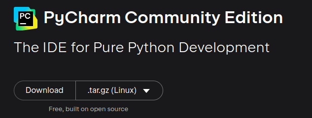

 caso queira um vídeo explicando <a href='https://youtu.be/HNUq8X_0nlM?si=HFSppf6tB4nsbbSb'>veja esse</a>. Agora uma dúvida que pode ter surgido é o que é uma IDE, a IDE é basicamente onde vamos rodar nossos códigos, pense nelas como se fosse um word, mas ao invés de corrigir o texto para português ou inlgês por exemplo ela vai corrigir o seu código e vai executá-lo. E o bom de ter instalado o Pycharm é que essa IDE já vem com o python instalado então não precisaremos nos preocupar com isso.
 

### Primeiros Comandos
Antes de você começar a escrever seus códigos, vou dar uma dica muito importante, tenha organização deixe seus códigos em pastas para você os achar de forma mais rápida.

O primeiro código que vou ensinar é o print(), este código vai mostar a informação que você desejar na tela, por mais que seja o primeiro código e seja bem simples ele é muito importante para todos os códigos que você for fazer, pois é com esse código que você verá a resposta do seu código, por exemplo vamos fazer o seu primeiro código em python, o famoso 'Olá Mundo!'.

No python quando usamos o print precisamos usar o parênteses, pois se trata de uma função (não precisa se preocupar em entender neste momento o que é uma função, só saiba que é nescessário usar o parênteses) e para escrevermos um texto em pyhton, seja num print ou não, sempre usaremos as aspas, pode ser aspas simples ou duplas, o mais usual na comunidade python é aspas simples. Então juntando tudo o que foi falado precisamos usar o print junto com os parênteses e para escrever um texto as aspas. O código ficaria assim. 
```python
  print('Olá Mundo!')
```

A resposta desse comando será:
```python
Olá Mundo!
```

Para fazermos esse código no Pycharm é exatamente igual, sempre vou deixar todos os códigos que fiz n pasta codigos e para explicar ou deixarei dessa forma vista aqui em cima ou colocarei um print da tela.
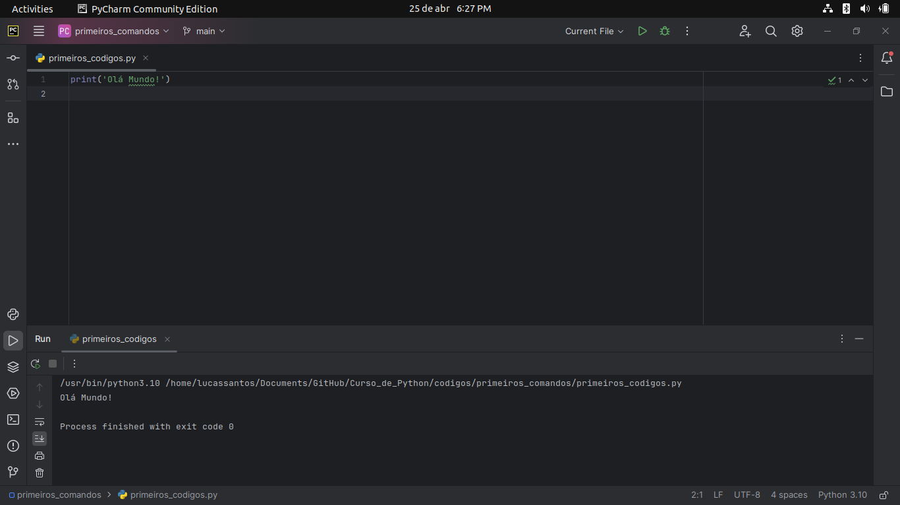

também podemos mostrar o resultado de uma conta no print(), mas dessa vez como usaremos números não podemos usar as aspas, pois elas indicam para o python que o conteúdo dentro delas é um texto e queremos trabalhar com números, sendo assim o print seria formado da segunte forma
```python
print(1+2)
```
A resposta será
```python
3
```

Caso você usasse as aspas o código ficaria assim
```python
print('1'+'2')
```
E a resposta desse código seria muito diferente do que você estaria esperando, pois isso seria lhe mostrado
```python
'12'
```

Isso acontece, pois o python concatenou (juntos) o texto '1' e o texto '2' formando o '12', ou seja, sabemos que quando usamos o + com números ele faz a adição e quando usamos o + com textos ele os junta, isso será mais aprofundado mais a frente, mas para não deixar isso sem uma explicação, foi basicamente isso que acontceu.


Outro código muito usado é o input(), esse comando vai pedir uma informação para o usuário, nesse comando também precisaremos usar as aspas para indicar ao usuário o que ele deve digitar, vou mostar a estrutura do código e depois já explico

```python
input('Qual a sua idade?')
```
o comando input vai pedir uma informação ao usuário e o que você digita dentro das aspas é o que vai aparecer para o usuário e como o que você vai escrever é um texto você precisa de aspas, mesmo que a resposta da pergunta seja um número.

Para o usuário isso vai acontecer:
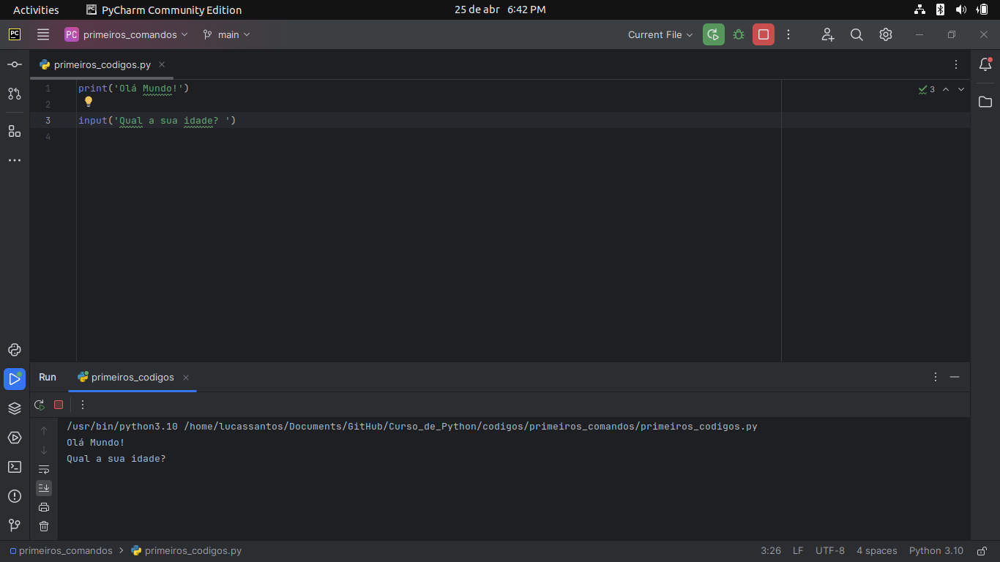

Nesse momento o seu código está esperando o usuário digitar a sua resposta, depois que ele digitar o programa será finalizado.

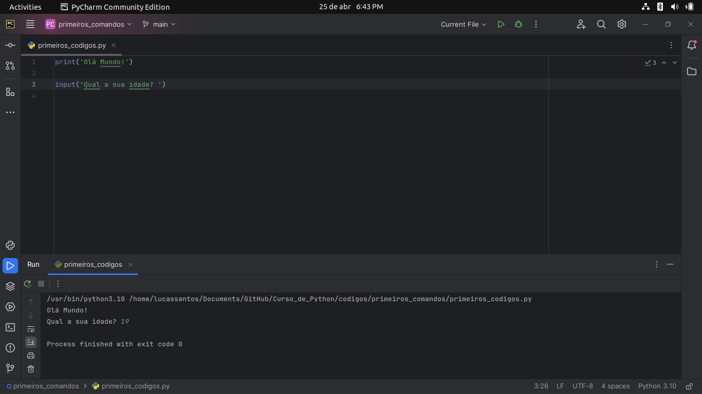

Você pode perceber que o comando do olá mundo também foi executado, pois na programação os comandos são executados de cima para baixo, caso você queria que um comando seja ignorado você pode comentá-lo usando a #, fazendo isso a linha comentada será ignorada pelo programa.

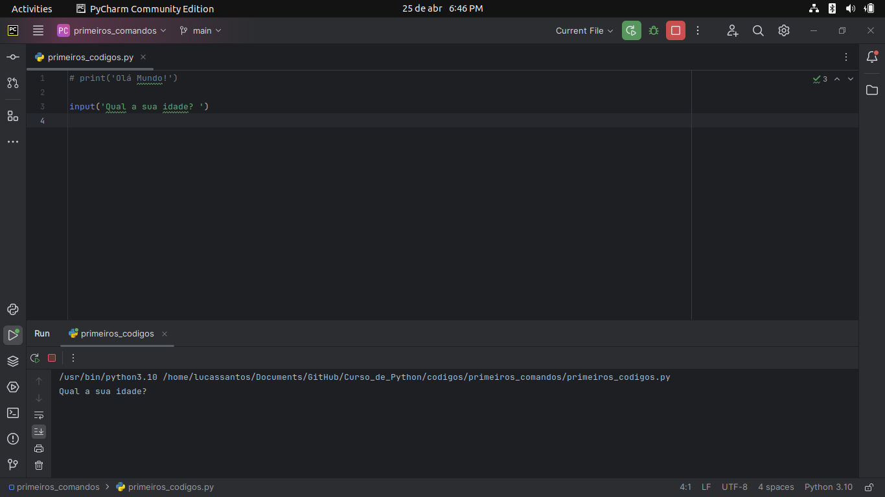

### Variáveis
Agora vamos começar a encorpar os nossos códigos e deixá-los mais versátil, vamos começar usar variáveis, e mesmo que você não goste de matemática fique tranquilo não vou pedir para você achar o X de uma equação.

As variáveis em python (e em qualquer linguagem de programação) são muito utilizadas, então vamos começar a aprender a usar as variáveis e por qual motivo elas são tão usadas.

Primeiro vamos a estrutura, uma variável pode receber várias coisas, um número, um texto, o resultado de um imput e sua estrutura sempre será a mesma, vamos aos exemplos:
```python
nome = 'Lucas'
idade = 19
hobby = input('Qual o seu hobby?')
```

De inicio isso pode assustar um pouco, mas vamos a explicação por partes.

A variável nome recebeu o valor 'Lucas', no python e nas outras linguagens de programação um igual '=' nós não lemos como igual, mas sim como recebe, ou seja, o nome recebe Lucas. A estrutura sempre será essa variável = valor, nunca o contrário. Agora para as outras a variável idade recebe 19, algo muito importante esse 19 é um número e não um texto então por isso não usamos as aspas. Agora para variável hobby, essa variável não vai receber o input, mas sim a sua resposta, ou seja, se nesse input você digitar 'Gosto de ver filmes' a variável vai ser isso, caso você digite 'Ouvir música' esse será o valor da sua variável, ou seja, ela vai mudar de acordo com as suas respostas.

E agora como podemos usar essas variáveis? simples, vamos montar um print bem simples com essas informações e ver qual a resposta. Para podermos usar as variáveis dentro do print precisamos fazer algumas alterações no print que conhecemos, vou mostrar como o código fica e depois explico. O print ficaria assim:

```python
print(f'Olá {nome}, você tem {idade} anos e gosta de {hobby}')
```
O 'f' antes das aspas diz ao python que dentro desse print usaremos variáveis, ou seja, torna o nosso código dinâmico e para podermos usar as variáveis escrevemos o nosso print normalmente, mas no lugar das nossas variáveis abrimos as chaves {} e digitamos os nomes das variáveis, fazendo isso na hora que nosso código for executado no lugar de de {nome} aparecerá o valor da variável nome, no lugar de {idade} aparecerá o valor da variável idade e no lugar de {hobby} aparecerá o valor da variável hobyy. Vamos supor que no hobby eu digitei 'Ver filmes' a resposta seria o seguinte:

```python
Olá Lucas, você tem 19 anos e gosta de Ver filmes
``` 

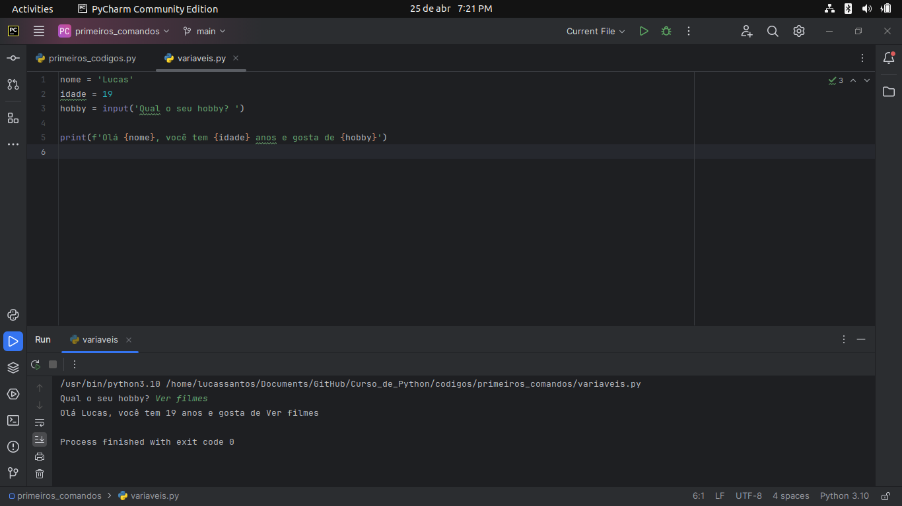

As variáveis são muito importantes, pois no nosso dia a dia como programador repitimos muitas vezes as informações, então imagine a seguinte situação, temos uma loja com mil produtos e o imposto sobre eles é de 1% e depois de um tempo o imposto foi para 2%, se você não tivesse usado uma variável você iria ter que mudar em todos os lugares o valor do imposto, já se você usou uma variável você só vai precisar mudar em um lugar e todos os valores de impostos seriam mudados automaticamente para você.

### Tipos Primitivos
No python temos 4 tipos primitivos: inteiros (int), pontos flutuantes (float), textos (string) e booleanos (bool), vamos a explicação deles:

int: o tipo inteiro ou int são os números que mais estamos acostumados a ver, ou seja, são números que não possuem sua parte decimal.

float: o tipo float ou ponto flutuante são os números reais, ou seja, os números que possuem sua parte decimal e aqui eu chamo a atenção para algo muito importante, um número float é escrito com o '.' (ponto) e não com a ',' (vírgula), nas linguagens de programação seguimos esse pardrão para colocar a parte decimal de um número.

string: o tipo string são os textos que escrevemos em python, sempre precisamos delimitar as aspas para escreve-los e algo muito importante que será usado mais pra frente no curso, toda resposta de um input vem no tipo string, mesmo que a resposta que você espera seja um número, vamos supor que você perguntou a idade de uma pessoa, mesmo que você estivesse esperando uma resposta do tipo int ela vira no tipo string, ou seja precisaremos mudar seu tipo, mas vamos ver isso mais pra frente.

bool: o tipo bool ou booleano são aceitos apenas dois valores True (verdadeiro) ou False (falso) e algo muito importante, para ser bool a primeira letra tem que ser maiúscula, ou seja, True é booleano já o true NÃO é booleano.

vou deixar uma tabela resumindo todos os tipos primitivos.

| Tipo   | Explicação | Exemplo |
|--------|-------|-------|
| int   | Representa um número inteiro | Ex: 0, 1, -54845, 54846 |
| float  | Representa um número com casa decimal    | Ex: 0.5, -6.7872, 9.5841, 1.0 |
| string | Representa um texto | Ex: 'Olá mundo!', '15'
| bool | Representa ou Verdadeiro ou False | Ex: True, False

Agora para explicar como eu vou converter de um tipo para o outro, vamos supor que você queira pegar a idade de uma pessoa e deixá-la em uma variável, nesse caso você faria o seguinte:

```python
idade = input('Qual a sua idade?')
``` 

Mesmo que a pessoa digite um número como resposta desse input o tipo dessa variável vai ser str (string), podemos ver isso usando a função type() como mostrado abaixo:


Nesta imagem podemos ver que ele realmente mostrou o 'número' 19, mas o python exerga isso como um texto como podemos ver no último print, então como podemos mudar isso, isso é algo muito simples vamos colocar o input() todo dentro de um novo comando o int(), isso vai fazer com que a resposta desse input seja convertida em um número inteiro como podemos ver abaixo:


O mesmo vale para os outros tipos, caso eu quisesse que fosse do tipo float eu coloco float():

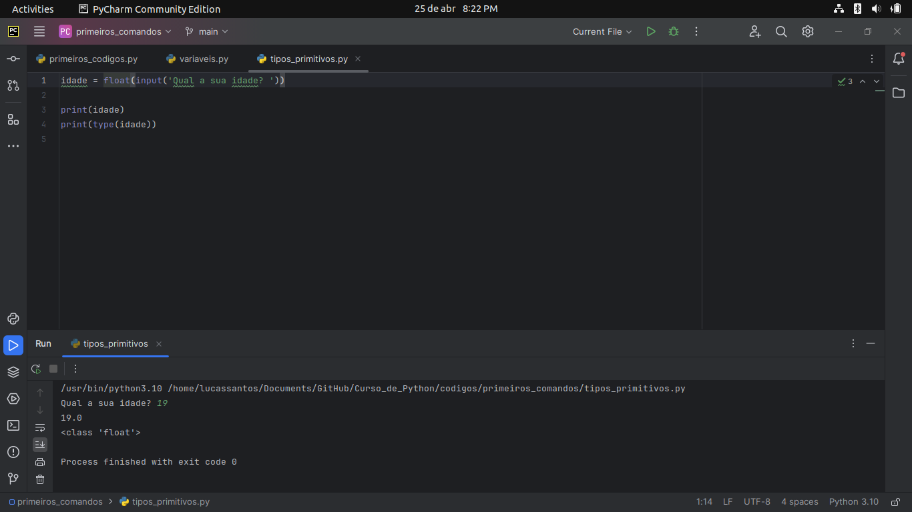

Mas, perceba que agora o número não mais apenas 19 e sim 19.0, por mais que para nós seja 'a mesma coisa' para o python isso é completamente diferente. Caso você queria converter para string você usará str().

### Operadores Aritméticos

Os operadores aritméticos são basicamente a soma e a subtração do python por exemplo, vou colocar em uma tabela para ficar mais fácil a vizualização:

| Operador   | Função |
|--------|-------|
| +   | Faz a soma de números ou concatena strings    |
| -  | Faz a subtração de números    |
| *  | Faz a multiplicação de números|
| /  | Faz a divisão de números|
| //  | Faz a divisão inteira de números|
| **  | Faz a potência de números|
| % (Módulo) | Faz o resto da divisão de números|

Agora vamos aos exemplos

```python
50 + 50 
Resposta: 100

50 - 10
Resposta: 40

3 * 10
Resposta: 30

100 / 10
Resposta: 10

5 ** 2
Resposta: 25

5 // 2
Resposta: 2
Explicação: Na divisão inteira, ela sempre ira considerar apenas a perte inteira de uma divisão,
mesmo que numa divisão normal ela tivesse sua parte decimal

5 % 2
Resposta: 1
Explicação: O módulo (%) sempre irá considerar o resto de uma divisão, ou seja,
ele faz uma divisão inteira e no final te retorna apenas o resto.
``` 

Algo muito importante é o símbolo de igual na programação é lido como recebe, por exemplo: idade = 19, na programação se lê idade recebe 19, para fazermos a comparação usamos dois iguais ==, ou seja, se você quiser comparar se a idade é 19 ficaria idade == 19, essa parte será retomada mais a frente no curso então pode ficar tranquilo.

### Ordem de Precedência

Na programação existe uma ordem para uma equação ser executada (assim como na matemáica), vou listar e explicar logo depois:

1º - ()

2º - **

3º - *, /, //, %

4º - +, -

Na programação caso em uma expressão exista parênteses ele será executado primeiro, depois vem a potência e logo após vem a multiplicação, divisão, divisão inteira e módulo, caso numa expressão tenha mais de uma, elas serão executadas na ordem que aparecerem e por último são executados as somas e as subtrações, lembre-se nem sempre o programa funcionar quer dizer que ele está correto.

Vamos a um exeplo bem simples para treinar a ordem de precedência, qual a resposta dessas expressões:

```python
(1+2*4)**2 = ?

1+5*2/4+(4**2) = ?
```

Primeira equação:

```
Primeiro fazemos o que está dentro do parênteses.
(1+2*4)
Como a multiplicação tem um peso maior que a soma primeiro multiplicamos e depois somamos
(1+8) -> (9)
depois de resolvido o parênteses vamos fazer a potência
9**2 
ou seja 9*9, sendo assim a resposta da primeira equação é: 81
```

Segunda equação:
```
Primeiro fazemos o que está no parêteses.
(4**2) -> (4*4)
depois fazemos a multiplicação e a divisão na ordem que aperece
1+5*2/4+16
1+10/4+16
1+2.5+16
a resposta é: 19.5

perceba que a divisão era apenas uma divisão normal, ou seja, precisamos fazer até mesmo a parte decimal dela.
```

Outra coisa que podemos fazer no python é 'multiplicar' as strings, vamos supor que você queria uma linha com 10 '-', ao invés de você escrever esses 10 '-' você pode fazer o seguinte:

```python
print('-'*10)

resposta: ----------
```

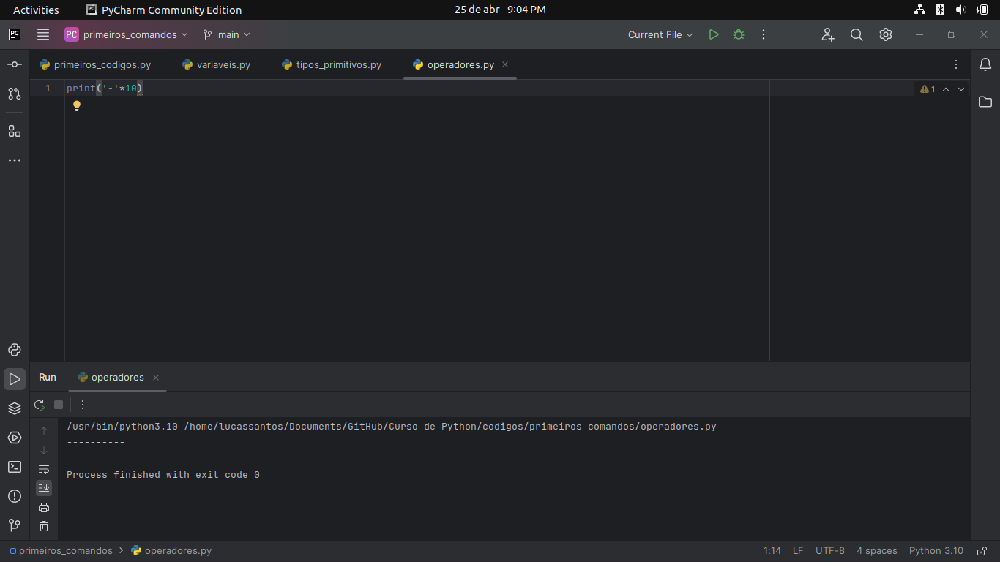

### Exercícios Módulo 1

Agora é hora de trinar, faça os exercícios abaixo para fixar o conhecimento. As resoluções dos desafios estão na pasta desafios.

```python
Exercício 1:
Peça ao usuário o seu nome, idade que ele terá no final do ano e
 mostre as seguintes informações: uma saudação com o nome da pessoa e o ano em que a pessoa nasceu.
```

```python
Exercício 2:
Peça ao usuário 3 notas e mostre a sua média e também as suas 3 notas
```

```python
Exercício 3:
Peça ao usuário um núemro e mostre seu sucessor, antecessor, dobro, cubo e sua raíz.
```

```python
Exercício 4:
Pergunte ao usuário um número e mostre a sua divisão normal por 2, sua divisão inteira por 2 e seu módulo por 2
```

```python
Exercício 5:
Pergunte ao usuário um número e mostre a sua tabuada até o 10.
```

Lembre-se primeiro tente fazer, pois é apenas assim que você vai realmente aprender, caso não consiga fazer consulte o código já feito.

## Estrutura de Decisão
Até o momento todas as linhas do nosso código eram executadas e a nós não conseguíamos 'deixar o nosso programa mais inteligênte', por exemplo caso o usuário faça isso executa isso, se ele fizer aquilo faz outra coisa. Basicamente o funcionamento do nosso código vai ser o mesmo independente da informação do nosso usuário.

Agora começando a explicar a estrutura de decisão no python. Pense na seguinte situação você é o dono de uma balada e nela só pode entrar pessoas com mais de 18 anos, suponhando que tenha um segurança na entrada aconteceria o seguinte, se você tiver mais de 18 anos você entra se não você não pode entrar. Com o conhecimento que temos de python no momento não conseguimos fazer isso, mas com as estruturas de decisão conseguimos. Vou mostrar a estrutura de decisão:

```
if condição:
  faz isso
```

Essa é a estrutura de decisão mais simples possível apenas um if (if significa 'se'), perceba que no python não temos chaves e nem ponto e vígula, então como que ele vai saber quando eu comecei o meu if e quando eu terminei? E a resposta é bem simples, pela identação (basicamente apertamos o tab do teclado) tudo o que está em baixo do if com uma identação pertence ao if, o que está em baixo do if, mas sem identação não pertence ao if, por exemplo:

```
if condição:
  pertence ao if
  pertence ao if
  pertence ao if
  pertence ao if
não pertence ao if
não pertence ao if
```
OBS: No python geralmente após terminarmos as estruturas nós pulamos uma linha para deixar o código mais organizado, então programando normalmente ficaria da seguinte forma:

```
if condição:
  pertence ao if
  pertence ao if
  pertence ao if
  pertence ao if

não pertence ao if
```

Agora montando um caso que usariamos o if programando em python, vamos supor que você quer saber se a confirmação senha que o usuário digitou está correta:

```python
senha = input('Digite a sua senha: ')
conf_senha = input('Confirme a sua senha: ')

if senha == conf_senha:
    print('Senha registrada com sucesso!!')
```

Vamos testar o nosso código, para fins explicativos vou mostrar as duas senhas:

Digitando igual para os dois:
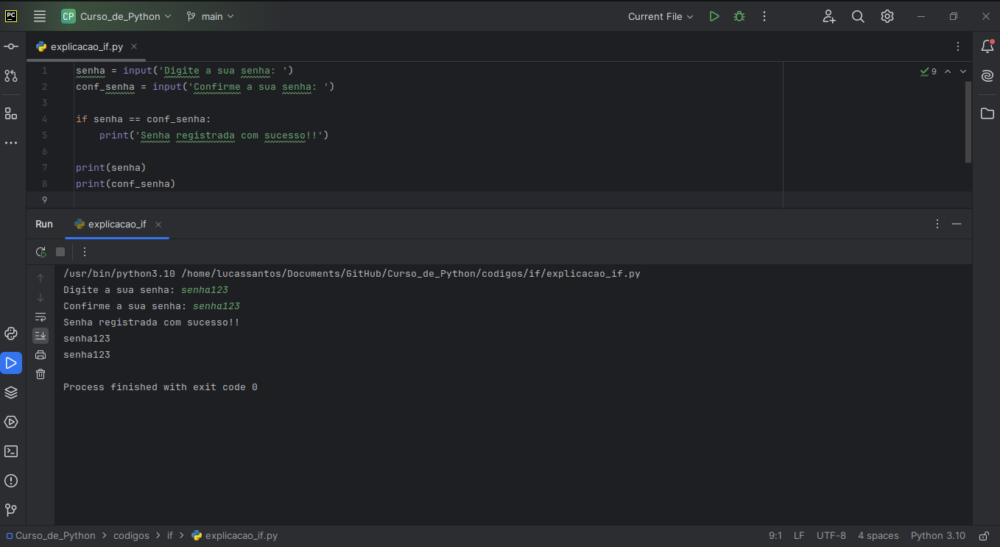

Perceba que o que está dentro do if foi executado e o print das duas senhas também, ou seja, a resposta para a nossa condição foi verdadeira então ele executa o que está dentro do if. Então podemos tirar a seguinte conclusão, se eu quero que algo seja executado e isso está dentro do if sabemos que só vai ser executado quando a resposta da condição for verdadeira (True).

Digitando errado:
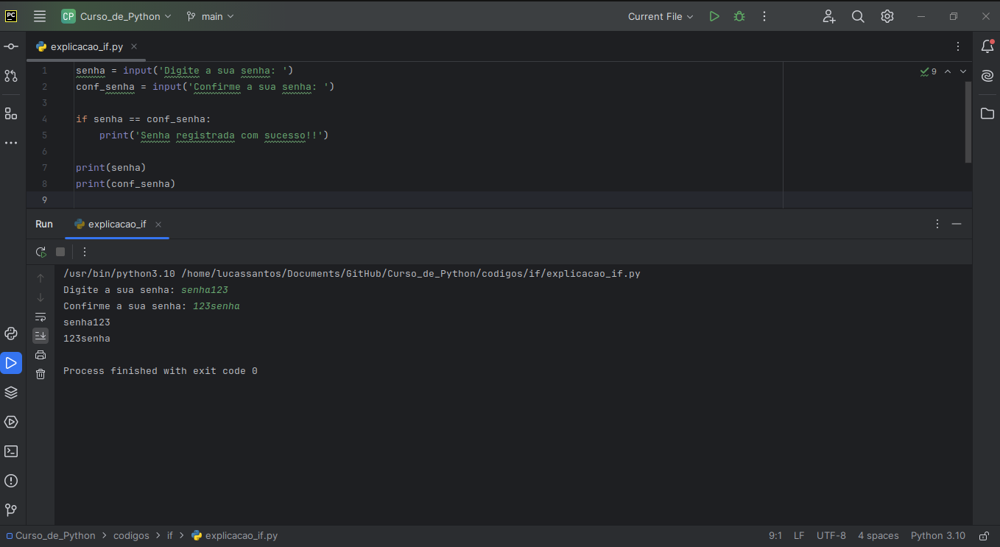

Já nesse código percebemos que o que está dentro do if não foi executado, pois a resposta da nossa condição foi falsa (False), mas as duas senhas foram mostradas, provando assim que o print das senhas não está dentro da estrutura do if.

Agora vamos aprender a ter mais caminhos que nosso código pode seguir, vou apresentar o elif e o else.
O elif é usado quando queremos ter mais caminhos de decisão, o elif precisa ser criado depois de um if e não pode ser a última estrutura.
O else é o 'se não', se todas as condições que você propôs deram como resposta False o seu código irá executar os comandos dentro do else, vamos ao exemplo:

Digamos que eu quero ver a idade de uma pessoa e falar se ela não pode votar, se o voto é opcional e se o voto é obrigatório (para o voto opcional vou considerar apenas dos 16 aos 18, vamos deixar esse código mais rebuscado daqui a pouco)

```python
# recebendo a idade do usuário e tranformando no tipo inteiro
idade = int(input('Digite a sua idade: '))

# começando o if

if idade < 16:
  print('Você não pode votar')
elif idade < 18:
  print('O seu voto é opcional')
else:
  print('Seu voto é obrigatório')
```

Testando quando a idade é menor que 16:


Testando quando a idade é menor que 18:

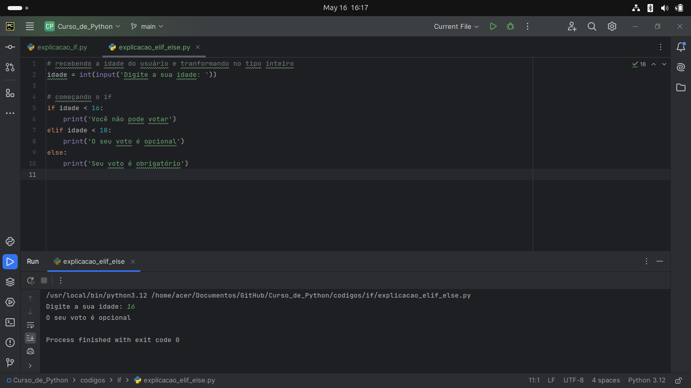


Testando quando a idade é maior que 18:

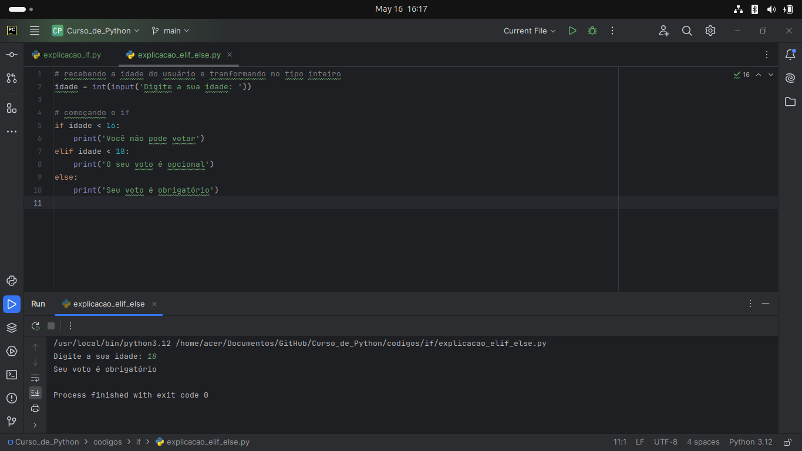

Perceba que quando usamos o '<' não é incluido, pois é apenas 'menor que' e não 'menor ou igual a', para incluir o número precisariamos escrever assim '<=', o mesmo vale para o sinal de '>', para escrever 'maior ou igual a' '>='.

Algo muito importante é o seguinte, (quando usamos o if/elif/else), se no meio do código um elif retornou True o python NÃO vai fazer os outros testes, pois essa estrutura seria como um bloco de decisão se algo retorna True ele vai executar apenas o que está dentro da estrutura que retornou True, agora caso usemos apenas if o python vai testar if por if e vai executar os comandos dos if's que retornaram True, o else só é executado se tudo o que está a cima dele for False, ou seja, todos os if/elif.

Outro conhecimento muito importante o conjunto de comparadores, vou colocar em uma tabela para facilitar a observação:

| Comparador   | Função |
|--------|-------|
| ==   | Faz a comparação de igualdade |
| !=  | Faz a comparação de diferença |
| <  | Faz a comparação de menor que |
| <=  | Faz a comparação de menor ou igual que |
| >  | Faz a comparação de maior que |
| >=  | Faz a comparação de maior ou igual que |
| in | Verifica se um texto existe dentro de um outro texto |
| not | Faz o contrário da comparação |


O que mais pode gerar dúvidas são o in e o not, então vou usar alguns exemplos para explicar.

Vamos supor que você quer saber o sexo da pessoa pelo o que ela digitou, você faria o seguinte código:

```python
sexo = input('Digite o seu sexo: ')
opcoes = 'fm'

if sexo in opcoes:
    print('Digitou corretamente')

```

OBS: caso seja digitado em maíusculo o python não vai reconhecer, pois ele é CaseSensitive (faz diferenciação entre maíuscula e minúscula)

Digitando certo:

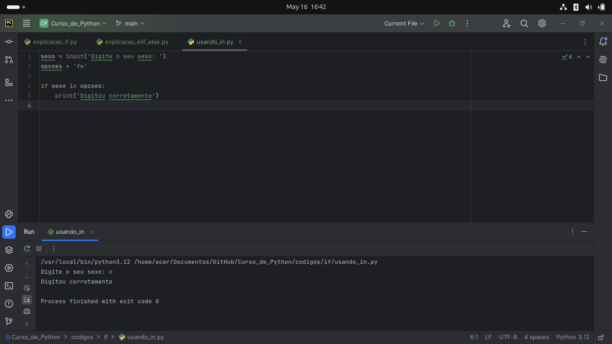

Digitando errado:

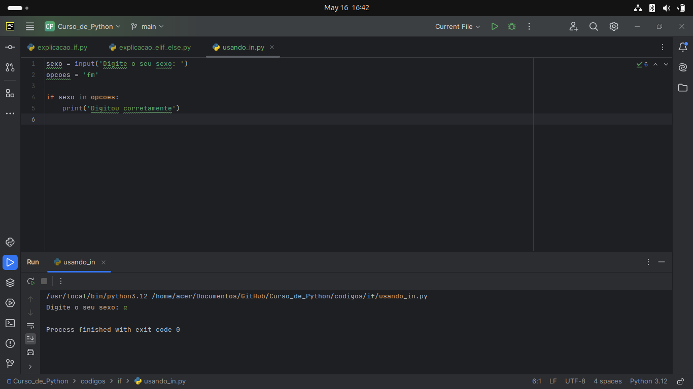

Já o not vai analisar o contrário da situação, vamos ao exemplo (vou usar o mesmo exemplo do sexo para ficar mais fácil a compreensão):

Digitando o sexo certo:

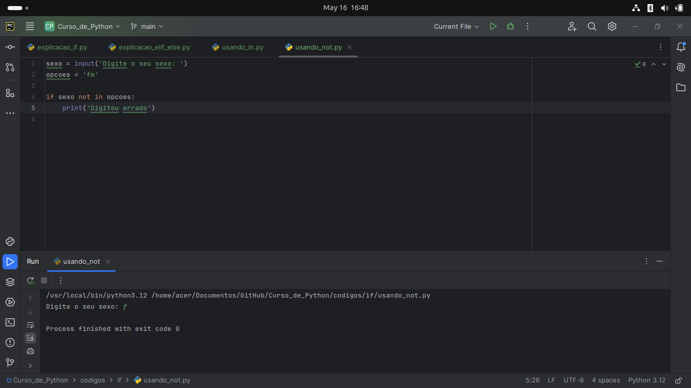

Digitando o sexo errado:

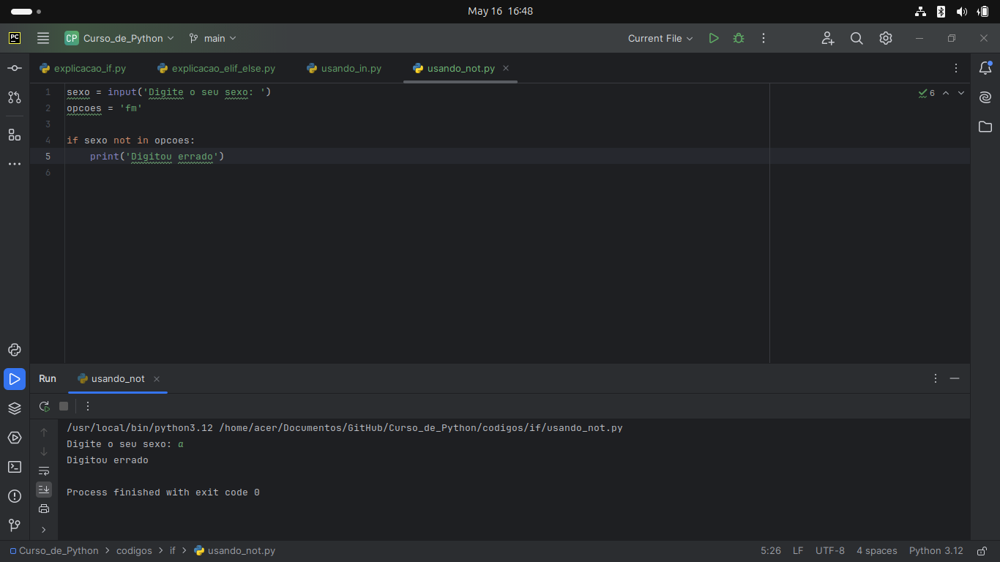


Ou seja, o not só retorna True caso o texto NÃO esteja dentro das opções.

Agora vamos supor que você quer usar um if dentro de outro if, como nós fariamos isso? É simples, vou mostrar o código e depois explicar:

Estrutura:
```
if condiçao:
  if condiçao:
    código
  elif condiçao: 
    código
  else: 
    códgio
```

Legendas para a explicação:
```
if condiçao: <- if pai
  if condiçao: <- if filho
    código
  elif condiçao: <- elif filho
    código
  else: <- else filho
    códgio
```

Ou seja, a estrutura é a mesma de quando fora de um if, mas a estrutura dentro do if 'pai' só é executada caso o retorno do if 'pai' seja True, o que está dentro do if 'filho' só vai ser executado se a resposta do if 'filho' for True e assim por diante.

Agora por último preciso falar sobre o 'and' e o 'or', eles são usados para nos auxiliar nas condiçõe. Quando usamos o 'and' todas as condições tem que ser verdadeiras para ser retornado True, já no 'or' apenas uma precisa ser verdadira para retornar True.

### Exercícios Módulo 2

Agora é hora de trinar, faça os exercícios abaixo para fixar o conhecimento. As resoluções dos desafios estão na pasta desafios.

Exercícios:

Exercício 1:
```
Receba cinco notas do usuário e calcule a sua média, caso a sua média seja maior que 7 ele foi aprovado, se sua média está entre 5 e 6.9 ele está de recuperação, caso a sua média seja menor que 5 ele está reprovado.
```

Exercício 2:
```
Receba um ano do usuário e retorne se o ano é bissexto ou não.

Dica: lembre da função do %
```

Exercício 3:
```
Receba uma senha do usuário e faça a confirmação. caso elas sejam iguais mostre que as senhas são iguais, caso sejam diferentes diga que são diferentes.
```

Exercício 4:
```
Suponhamos que você vai dar um desconto num determinado produto da sua loja, mas para isso a pessoa precisa ter um cadastro na sua loja, ter gastado mais de R$50,00 e ter mais de 18 anos.
```

Lembre-se primeiro tente fazer, pois é apenas assim que você vai realmente aprender, caso não consiga fazer consulte o código já feito.

# Olá, eu sou o Lucas! 👋
Aos 19 anos, trilho meu caminho na Ciência de Dados com paixão pela programação. Com habilidades avançadas em Python e conhecimento intermediário em SQL, enfrento desafios com entusiasmo, especialmente na criação de inteligência artificial. Embora meu inglês seja inicial, estou dedicado aos estudos para aprimorá-lo. Estou aqui para aprender, crescer e deixar minha marca na interseção entre dados e inovação.

## Links para me contatar 🔗 
[](https://github.com/LucasSantos875478)
[](https://www.linkedin.com/in/lucas-santos-454584285/)
[](https://www.instagram.com/lucassantos.py/)
